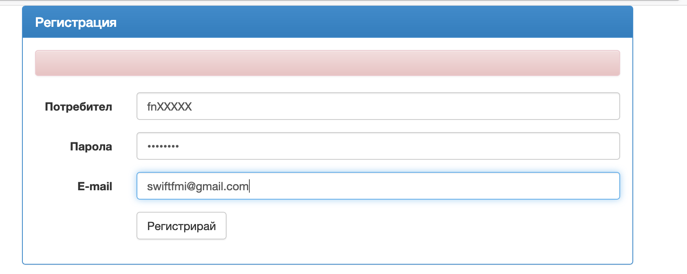

## Първото задание за самостоятелна домашна работа

Решениятo на всяка задача ще трябва да качите в нашия портал на следния адрес - [https://swiftfmi.apposestudio.com/](https://swiftfmi.apposestudio.com/)

Всеки __ТРЯБВА__ да се регистрира с факултетния си номер.



За всяка задача, ще имате определена страница, където ще може да видите колко точки получавате.


Трябва да свалите шаблона и да попълните решението в него. Не оставяйте ненужни `print` извиквания във вашето решение. Системата няма да може да оцени некоректни решения и ще покаже съответната икона.


Ако имате някакви въпроси за системата, моля пишете на имейла за контакт.

Крайният срок за качване на решенията е _09.04.2025_!


## Задачи:

1. Дадени са няколко различни изписвания на версиите на един продукт. За правилна версия ще считаме тази, която следва [semver](https://semver.org/lang/bg/) конвенцията. Напишете функция, която по списък от версии да определя максималната, като версиите могат да бъдат еднозначно сравнени, ако са валидни.

Ето и пример, който показва как трябва да функционира решението:
```swift
findMaxVersion(all: ["1.0.1", "1.2", "1.0.2", "1.11"]) // "1.11"
// 
```
    
> Всяка задача има шаблон, който трябва да свалите. В него попълвате решението, като не променяте името на основната функция и качвате файла. Трябва да не отпечатванте нищо в конзолата, за да успее системата да оцени вашето решение.

```swift
func findMaxVersion(all: [String]) -> String? {
    return nil
}
```

2. Да се нaпише функция, която пресмята стойността на прост математически израз от вида по-долу, подаден като `String` препоръчва се използването на рекурсия:
	
	__Скобите ще са винаги налични и изразът ще е коректен!__

    > Рекусривното решение лесно може да постои двоично дърво от израза и да го пресметне, понеже са позволени само бинарни операции.
    > Ще се приемат всякакви решения.
	
	Пример: 
		
		((23 + 6) * 2)
	
	Възможните операции са ```^(степенуване), *, /,  +, - ```.
	```swift
	func evaluate(expression: String) -> Double {
		//TODO: your implementation goes here
		return 0.0
	}
	```
	
3. Да се напише функция, която намира броят на различните достижими изходи от лабиринт, зададен в двумерен масив (матрица). Ако няма намерени, да връща ```0```.

	_Препоръчително е да се използват помощни функции и структури._
 
	Пример: 
		
		^ 0 0 0 0 0 0 1
		0 1 1 1 1 1 0 0
		0 0 0 0 0 1 # 1
		0 1 1 1 0 1 0 0
		0 1 * 1 0 1 0 1
		0 0 0 1 0 1 0 *

```swift
    var testMaze = [
        ["^", "0", "0", "0", "0", "0", "0", "1"],
		["0", "1", "1", "1", "1", "1", "0", "0"],
		["0", "0", "0", "0", "0", "1", "#", "1"],
		["0", "1", "1", "1", "0", "1", "0", "0"],
		["0", "1", "*", "1", "0", "1", "0", "1"],
		["0", "0", "0", "1", "0", "1", "0", "*"]]
```
        
    Извикването на функцията, трябва да връща: 
    
           1

	Където:
	
		0 е проходимо поле
		1 е непроходимо поле
		^ е началната позиция
		* е изход от лабиринта
        # е непроходимо поле

    > Защо отговорът е `1`?


Примeрна функция:
```Swift           
	protocol Maze {
		init(raw: [[String]])
		...
	}
	
	func findPaths(maze: [[String]]) -> Int {
	    // TODO: your implementation goes here
        return -1
    }
```
